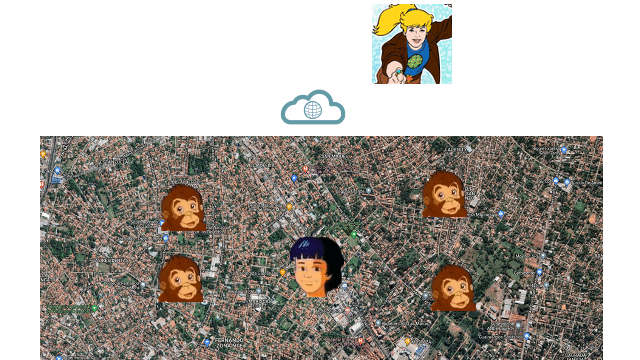
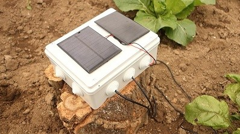
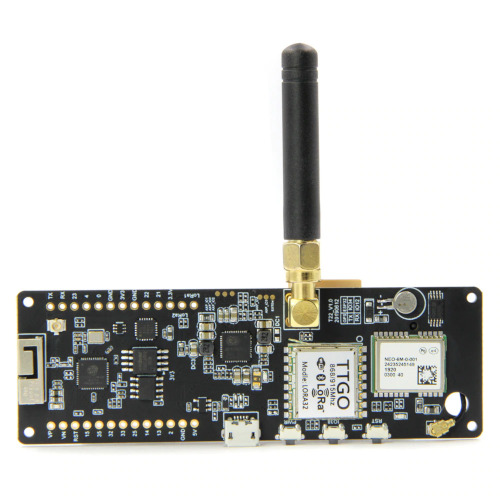
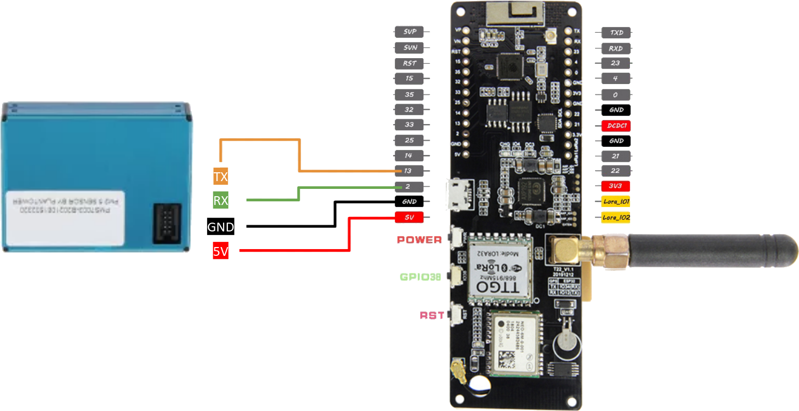
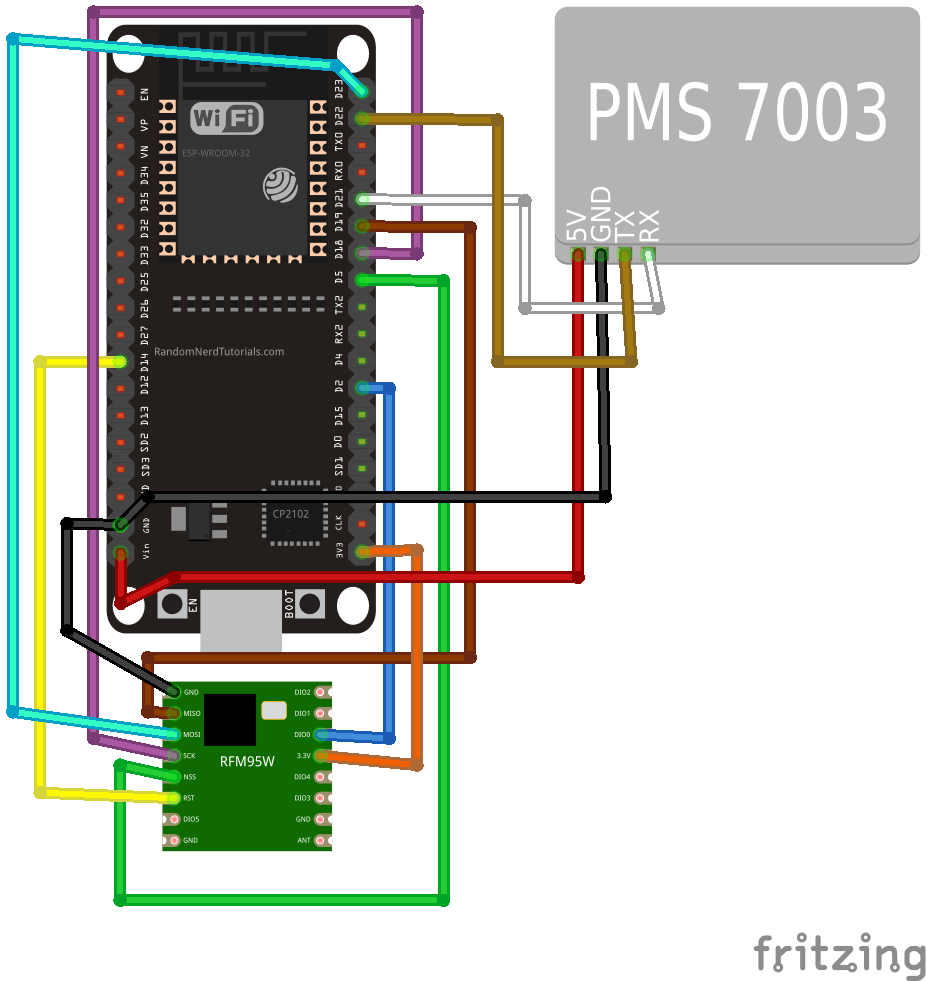
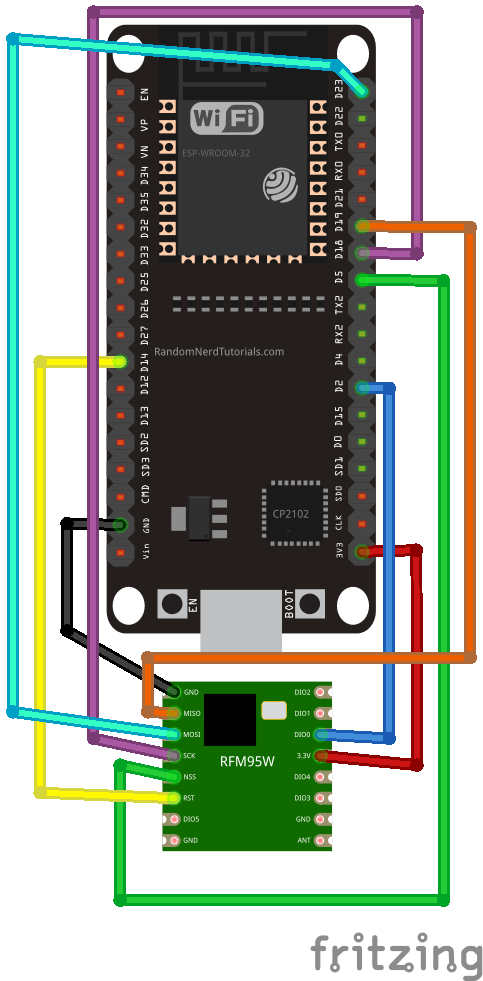
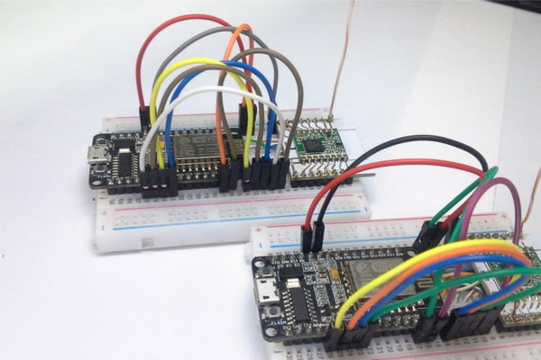

# Suchi and Ma-ti

This repository contains the information for devices that sends Particulate Matter information to receiving nodes using LoRa for [AireLibre](https://airelib.re/)

It consists of two main parts:

- [Suchi](https://github.com/neowinx/planeteers/tree/main/suchi-firmware): The firmware for the sensors that sends the data
- [Ma-ti](https://github.com/neowinx/planeteers/tree/main/ma-ti-firmware): The firmware for the node that receives the data from __suchi__ and forwards it to [Linka](https://github.com/tchx84/linka)

## Whats the big idea?

The idea is to have a way to deploy multiple nodes that report the values gathered from the PMS to some areas where the access
to a network connection or even electricity are somewhat restricted or areas where makes sense to deploy some hardware
under minimal infraestructure, or even off the grid, to gather the particulate matter information

The following "cutting edge" animation will show the idea in a more "eye-candy" way:

Every node on the field should be an independently working suchi node that should look something like this (image only for reference)

image from https://randomnerdtutorials.com/esp32-lora-rfm95-transceiver-arduino-ide/

## Motivation

I just recently found out about all the [ LoRa ](https://en.wikipedia.org/wiki/LoRa#LoRaWAN) stuff, and since it's relatively new to me (even though it has been around quite some years already)
I have been trying to devise a project to use it

Around this time, I stumble with the [ AireLibre ](https://airelib.re/) initiave, and since the project is revolving around 
ubiquitous sensors, the opportunitty of implementing a self sustainable sensor (solar charged, low power) using hobbiest 
level hardware was the answer I was looking for!

### Why two separate projects?

I know that probably there's no need to separate both roles (the sender and the receiver) in two projects, since we could've just manage those differences using precompiled macros

The reason for not doing that, is that we want a minimal codebase in order to have a small memory footprint for the nodes, and having to manage precompiled macros and the resulting
code from them will probably result in someone (mainly myself) making a regrettable mistake

Also, it looks cleaner to have those two things separated for people not very keen into coding but that wants to contribute to the project in a foreseeable future, so in the meantime
we will mantain these two projects until we see otherwise even if that means that some lines of code will be duplicated

### Suchi? Ma-ti? What's up with these weird names

We are following with the main theme of naming our projects with a [ planeteers ](https://captainplanet.fandom.com/wiki/Captain_Planet_and_the_Planeteers) name
within AireLibre. Refer to [ this answer ](https://github.com/melizeche/AireLibre#por-qué-linka) for more information about that

[ Ma-ti ](https://captainplanet.fandom.com/wiki/Ma-Ti) is the planeteer of south america and [Suchi](https://earth27.fandom.com/wiki/Suchi) was his pet monkey

### Why not LoRaWAN?

The first prototype for this project was indeed a LoRaWAN node in order to use the [ TTN infraestructure ](https://www.thethingsnetwork.org/)

But gateways are rather
scarse in [ Paraguay ](https://www.thethingsnetwork.org/community) (0 gateways actually in my city) so I began to construct one of those single channel gateways 
(or single channel relays.. or whatever they are called now...)
for testing purposes, only to find out that those are [ condemned by the TTN community ](https://www.thethingsnetwork.org/forum/t/the-future-of-single-channel-gateways/6590)
and that the [ V2 of the TTN will be shutdown this 1 of december 2021 ](https://www.thethingsnetwork.org/forum/t/the-things-network-v2-is-permanently-shutting-down-scheduled/50710)

Because of this, at the current date, TTN V2 is not registering new gateways anymore, only leaving me with the V3 option that only accepts official (proper) gateways from one of the
selected manufacturers or to [ buildin a proper one ](https://www.thethingsnetwork.org/docs/gateways/start/build/) myself.

All that just gives me the same headache you're probably having now, so I will only use LoRa for the moment since the application in this case scenario is rather
simple

Maybe in the future I will reevaluate to use LoRaWAN

Thank you for reading until this point, If I haven't lost you, let's proceed to the more interesting part of the project

## Hardware

- Plantower PM2.5 PMS7003 G7 with Adapter Board and Cable [AliExpress](https://www.aliexpress.com/item/32784279004.html) [Amazon](https://www.amazon.com/DSLE-Digital-PLANTOWER-PMS7003-Adapter/dp/B08M2F4B9R)
- 18650 battery [AliExpress](https://www.aliexpress.com/wholesale?catId=0&initiative_id=AS_20210928063050&SearchText=18650+battery) [Amazon](https://www.amazon.com/s?k=18650+battery&ref=nb_sb_noss_1)
- Exterior plastic box 100x100mm [Luminotecnia](https://www.luminotecnia.com.py/producto/1265/Caja-Exterior-Plastica-de-Conexion-100x100)

_The following parts are just here for reference since I will test them on christmas (no, I am not kidding, I need to wait 3 months for these stuff to arrive)_

- Solar Panel 5V 250mA (anny size will do, but it needs to fit in the top off your case) [AliExpress](https://www.aliexpress.com/wholesale?catId=0&initiative_id=SB_20210928063647&SearchText=Solar+Panel+5V+250mA) [Amazon](https://www.amazon.com/s?k=Solar+Panel+5V+250mA&ref=nb_sb_noss_2)
- TP4056 Charging Module [ AliExpress ](https://www.aliexpress.com/wholesale?catId=0&initiative_id=SB_20210928074815&SearchText=TP4056) [ Amazon ](https://www.amazon.com/s?k=TP4056&i=electronics&ref=nb_sb_noss_2)

### Boards

Both projects (suchi and ma-ti) supports the next boards as the core hardware (we will be adding more in the near future)

#### - TTGO T-Beam

- TTGO T-Beam ESP32 915MHz [AliExpress](https://www.aliexpress.com/item/4001178678568.html?spm=a2g0o.productlist.0.0.55c05386IacCzc&algo_pvid=b483f02b-ea80-4f11-bde8-c2762328d077&algo_exp_id=b483f02b-ea80-4f11-bde8-c2762328d077-0&pdp_ext_f={"sku_id"%3A"12000024058303348"}) [Amazon](https://www.amazon.com/LILYGO-Meshtastic-T-Beam-Bluetooth-Battery/dp/B097H11PJY/ref=sr_1_2?dchild=1&keywords=ttgo+t-beam&qid=1632840422&sr=8-2)

This board comes with an esp32, a NEO-6M GPS module, a Bluethoot module and a SX1276 LoRa module embedded in the board.
Also comes with an external antenna and a 18650 battery holder

It is the more expensive alternative, but it comes with almost everything needed to deploy a node right away

**Wiring for Suchi**

Just connect the Plantower pins corresponding to the ground and voltage and use the pins 2 and 13 for the Rx and Tx communication

**Wiring for Ma-ti**

No need to wire anything since everything is already connected in the board. So, here's a kitty

#### - HopeRF with Esp32 devkit v1.1

- HopeRF RFM95W 915Mhz, LoRa Ultra Long Range Transceiver, SX1276 [AliExpress](https://www.aliexpress.com/item/32964829308.html?spm=a2g0o.productlist.0.0.44ca2b2ezvW5wE&algo_pvid=9631870e-d7f2-4094-8764-b9b851ca89e7&algo_exp_id=9631870e-d7f2-4094-8764-b9b851ca89e7-1&pdp_ext_f={"sku_id"%3A"66523663284"}) [ Amazon ](https://www.amazon.com/RFM95W-Transceiver-Compatible-Technical-Support/dp/B07KZPQ4GB/ref=sr_1_3?dchild=1&keywords=hoperf+rfm95+lora&qid=1632844184&sr=8-3)
- Esp32 doit devkit v1.1 [ AliExpress ](https://www.aliexpress.com/item/32928267626.html?spm=a2g0o.productlist.0.0.63c09063WAHduP&algo_pvid=be5c1b93-4cce-4729-a95e-51976a6cb7a1&algo_exp_id=be5c1b93-4cce-4729-a95e-51976a6cb7a1-0&pdp_ext_f={"sku_id"%3A"12000016847177755"}) [ Amazon ](https://www.amazon.com/ESP32-WROOM-32-Development-ESP-32S-Bluetooth-Arduino/dp/B084KWNMM4/ref=sr_1_2_sspa?dchild=1&keywords=doit+esp32+devkit&qid=1632844382&sr=8-2-spons&psc=1&spLa=ZW5jcnlwdGVkUXVhbGlmaWVyPUFXNk0wTko0VEQwNkMmZW5jcnlwdGVkSWQ9QTAwMzI2NTIxM0NPSlRFRTFDTUdGJmVuY3J5cHRlZEFkSWQ9QTA5MDk1NzQxN1RIMkxYMUdMRThHJndpZGdldE5hbWU9c3BfYXRmJmFjdGlvbj1jbGlja1JlZGlyZWN0JmRvTm90TG9nQ2xpY2s9dHJ1ZQ==)

This is the more barebone alternative. The links to buy these parts are just for reference, if you find a better price for
these parts go ahead!

**=======**
**CAUTION**
**=======**

DANGER WILL ROBINSON! DANGER!

Do not power the LoRa modules without an antenna or you risk frying your module!!!

**Wiring for suchi**

Below is presented the schematic to connect the LoRa modules with the PMS to the esp32 devkit

**Wiring for Ma-ti**

The wiring for ma-ti es the same for the LoRa module without the PMS

**Antenna**

It is recommended to use a [proper atenna](https://www.aliexpress.com/wholesale?catId=0&initiative_id=AS_20210928101349&SearchText=915mhz+lora+antenna) 
(for 915 MHz modulation in this case) for better results in receiving the data from the nodes

But if you really wanna go with the homeless approach you can manufacture the antenna from a UTP cable you don't need anymore

Thanks to [ this instructables ]( https://www.instructables.com/Communication-LoRa-ESP8266-Radio-RFM95/ ), mannufacturing a antenna for the module was quite easy

Just cut 7.8 cm of a single cable form your UTP Cable (Unshielded Twisted Pair), thanks to [ absolutelyautomation.com ]( absolutelyautomation.com ) for the information,
to calculate the length of the antenna, only the most important parameter "Frequency" needs to be inserted, in the case of my module it is to 915.0

The antenna should look something like this

image from https://www.instructables.com/Communication-LoRa-ESP8266-Radio-RFM95/

#### Power

WIP since I still haven't received the parts. Will update this as soon as I get my hands on them

## Installation

Reference for the firmware installation are in their corresponding projects:

- [Suchi](https://github.com/neowinx/planeteers/tree/main/suchi-firmware)
- [Ma-ti](https://github.com/neowinx/planeteers/tree/main/ma-ti-firmware)

## Good Luck!

[ neowinx ](https://github.com/neowinx)
